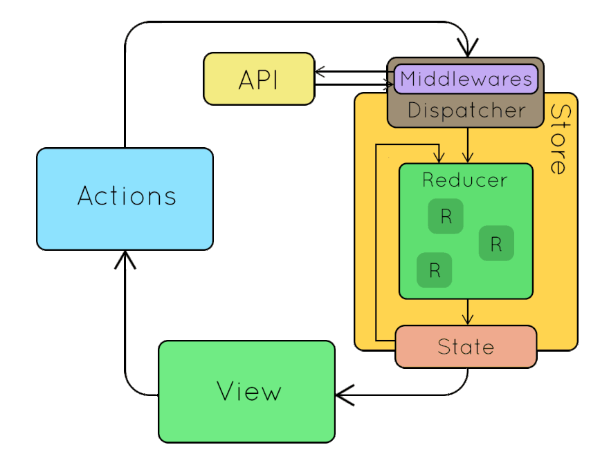
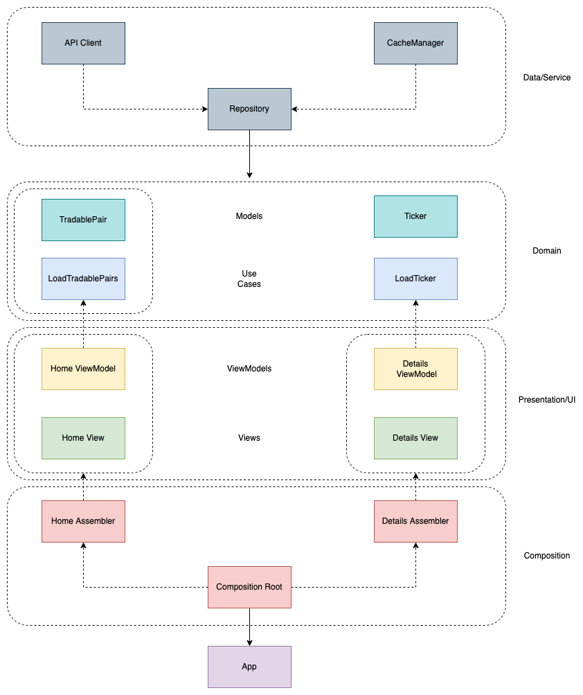

# Architecture

The App Architecture has been designed taking inspiration from the principles of the Clean Architecture by Robert Martin a.k.a. UncleBob.

https://github.com/CS-Development/KrakenDemo/projects/1

The Architecture has also influenced the definition of the project modules and the project structure by implementing a separation between data, business logic, presentation logic and ui.

The app project structure is split over following folders:

- Utils: common utils for all the layers 
- Data: data and service layer interfaced over gateways
- Domain: business logic made of Entities and UseCases
- Presentation: Presenters (view models) and UI
- CompositionRoot: app composition made of Dependency Injection Containers

The unit tests folder structure reflect that of the app.

The presentation layer has been implemented following a "MVVM Redux" pattern, a combination of MVVM Input/Output with Redux pattern.

In specific, the ViewModel separates between what is "input" (user's actions), what are the use cases and what is "output" (data and view model's state to present to the UI).  A Redux reduce/transform transform input in output and updates the view model's state.

Furthermore, this pattern mechanisms are enhanced by the reactive functionalities provided by Combine, de facto boosting the Redux application's state management with FRP paradigm, what is the perfect companion to the SwiftUI declarative and state-based user interface toolkit.

Despite of the State management provided by @EnvironmentObject and all connected property wrappers of SwiftUI, Redux gives us a structure on how to organize the flow of the global state while nicely making use of those wrappers objects.

With this architecture being setup, a possible workflow for implementing loosely coupled features in the modulare architecture would be as the following:

- Implement Data layer
- - API
  - Model
  - Repository gateways
- Define Use Cases
- - Entities
  - Business Logic Rules
- Implement Presentation Layer
  - Define Tabs and Navigation
  - Define UI Style
  - Define Scenes/Features
    - Instanciate multiple „MVVM Input/Output + Redux transform“ Template
    - Create UI
    - Connect to UI to ViewModel's Input/Output
    - Implement presentation logic/rules inside the Redux transform

- Implement Composition
  - Define DI Container, assembler/factories..

## App Architecture

[**back**](https://github.com/CS-Development/KrakenDemo)

