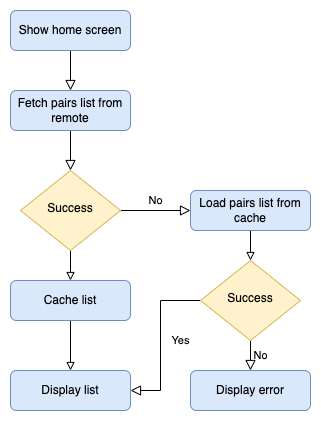

# Feature Specs (BDD)

### Story: User wants to see the list of all tradable pairs


### Narrative 1 

```
As an online user
I want the app to automatically load all tradable pairs
So I can see basic informations (pair name, last trade, volume last 24h)
```

#### Scenarios (Acceptance criteria)

```
Given the user has connectivity
 When the user goes to home screen
 Then the app should display all tradable pairs with basic infos
  And replace the cache with the new data
```


### Narrative 2

```
As an offline user
I want the app to show the latest cached data
So I can always see some information
```

#### Scenarios (Acceptance criteria)

```
Given the user doesn't have connectivity
  And there’s a cached version of the data
 When the user requests to see the list of pairs
 Then the app should display the latest data saved

Given the user doesn't have connectivity
  And the cache is empty
 When the user requests to see the list of pairs
 Then the app should display an error message
```


## Use Cases

### Load List From Remote Use Case

#### Data:

- URL

#### Primary course (happy path):

1. Execute "Load All Tradable Pairs" command with above data.
2. System downloads data from the URL.
3. System validates downloaded data.
4. System creates pairs list from valid data.
5. System delivers pairs list.

#### Invalid data – error course (sad path):

1. System delivers invalid data error.

#### No connectivity – error course (sad path):

1. System delivers connectivity error.

------

### Load List From Cache Use Case

#### Primary course:

1. Execute "Load All Tradable Pairs" command with above data.
2. System retrieves data from cache.
3. System creates list from cached data.
4. System delivers list.

#### Retrieval error course (sad path):

1. System delivers error.

#### Empty cache course (sad path):

1. System delivers no list.

------


## Flowchart 




