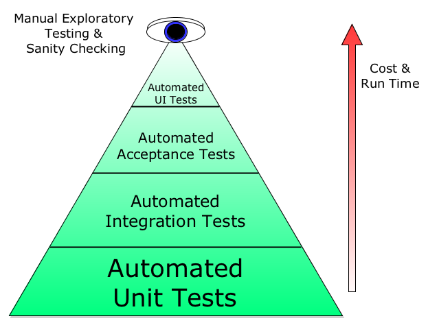

# Unit Testing

There are different types of tests at different levels and these are described by the **Testing pyramid**

	

**Unit testing** is a process of testing individual software components, the purpose is to validate that each unit of software is working as expected.

**Integration tests** are meant to validate the functioning of units working with each others.

**Acceptance tests** are meant to validate the business requirements satisfaction.

**UI Tests** are intended to validate the ui appearance, design and ux.

In this project I just gave a little example of Unit testing structure, without to enter in deep details and to fully implement the tests.

We start testing at the bottom of the architecture, the Data layer. You don't want to test your API Service against the real endpoint, because: 

- network requests are async
- they might take a long time to give an answer back
- the anwer time depends on the network conditions
- they might fail

And this is something we don't have to control over and we are not responsible for.

We want indeed to run reliable tests. We just want to test that:

- When we get an answer and the answer is correct, the answer is correctly interpretated
- When we get a failure answer, the system reacts correctly propagating the error to the above layers. 

### TEST DOUBLES

As we don't want and we don't need to test the working functionality of, for example, URLSession, URLRequest and we don't want to rely on the instability of the internet connection, we replace this object with something that make test easier: test doubles.

There are 5 types of test doubles:

- stubs
- mocks
- dummies
- spies
- fakes

Test stubs replace an object with hard code values.

Test mocks simulate the behaviour of real objects in a way we can make some assertions on it.

Test dummies are "empty" objects used just as placeholders in testing the unit.

Spies are like stubs but they also keep track of some information on the internal state of our unit, so that we can make extra assumptions on it.

Fakes are objects that provides a different implementation of the system under test. Used for example when we want to test a sut that internally makes some data validation, but in our tests we want to skip this validation. 

Example:

In order to test our KrakenRepository we create an instance of it passing a mocked or stubbed version of the KrakenAPI

sut = KrakenRepository(apiClient: mockApiClient)

we call then the method we want to test and we look if we get an answer

_ = sut

​      .getTradableAssetsPairs()

​      .sink(receiveCompletion: { _ **in** }) { response **in**

​        XCTAssertNotNil(response)

​        expectation.fulfill()

​      }